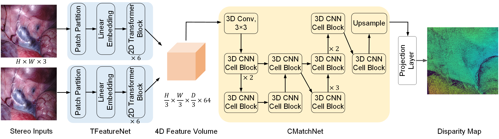

## HybridStereoNet

This repository contains the code for our MICCAI 2022 paper `Deep Laparoscopic Stereo Matching with Transformers` 



## Requirements

### Environment

1. Python 3.8.*
2. CUDA 10.0
3. PyTorch 
4. TorchVision 

### Install
Create a  virtual environment and activate it.
```shell
conda create -n hybristereo python=3.8
conda activate hybristereo
```
The code has been tested with PyTorch 1.6 and Cuda 10.2.
```shell
conda install pytorch=1.6.0 torchvision=0.7.0 cudatoolkit=10.2 -c pytorch
conda install matplotlib path.py tqdm
conda install tensorboard tensorboardX
conda install scipy scikit-image opencv
```

Install Nvidia Apex


Follow the instructions [here](https://github.com/NVIDIA/apex#quick-start). Apex is required for mixed precision training. 
Please do not use pip install apex - this will not install the correct package.

### Dataset
To evaluate/train our network, you will need to download the required datasets.

* [SceneFlow](https://lmb.informatik.uni-freiburg.de/resources/datasets/SceneFlowDatasets.en.html)

* [SCARED 2019](https://endovissub2019-scared.grand-challenge.org/)

* [dVPN](http://hamlyn.doc.ic.ac.uk/vision/)

### Prediction

You can evaluate a trained model using `prediction.sh` for each dataset, that would help you generate *.png or *.pfm images correspoding to different datasets.
```shell
sh predict_scared.sh
sh predict_davinci.sh
```

### Evaluate Tool  

Use the file 'main_all.m' in eval folder to evaluate your model. Download our pre-trained model via this link: [snapshot](https://drive.google.com/drive/folders/1iqLlMQFxjdCMuq0i3NpQu5FGq5xs0BVS?usp=sharing).

### Acknowledgements


### Citing
If you find this code useful, please consider to cite our work.

```
```

